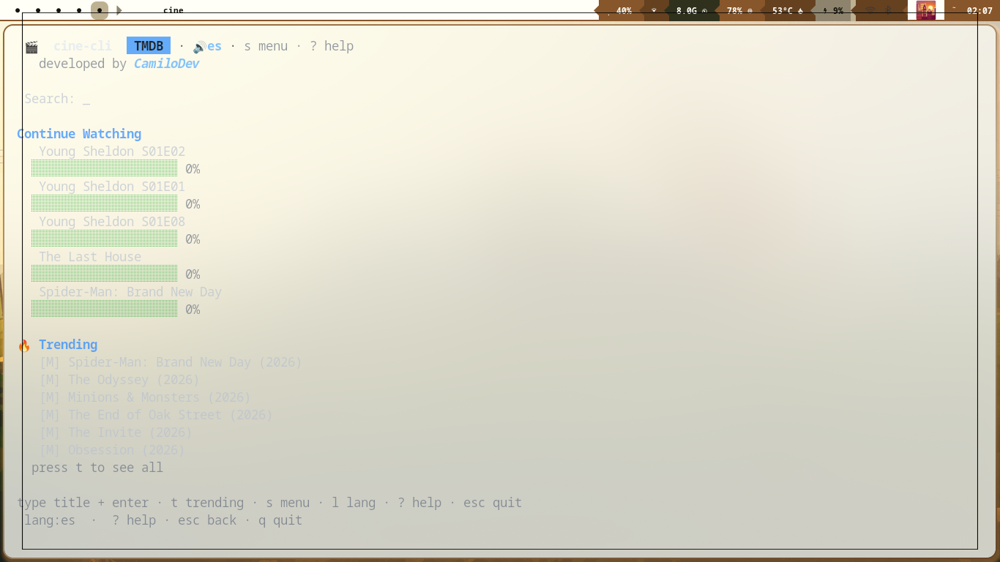
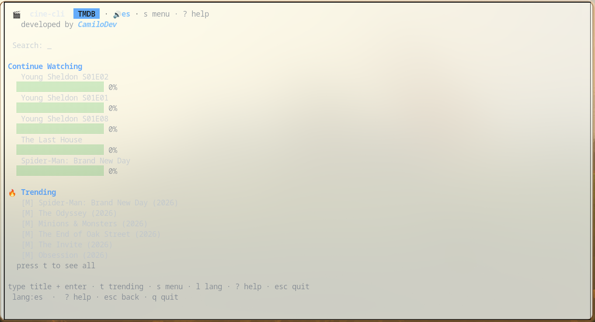
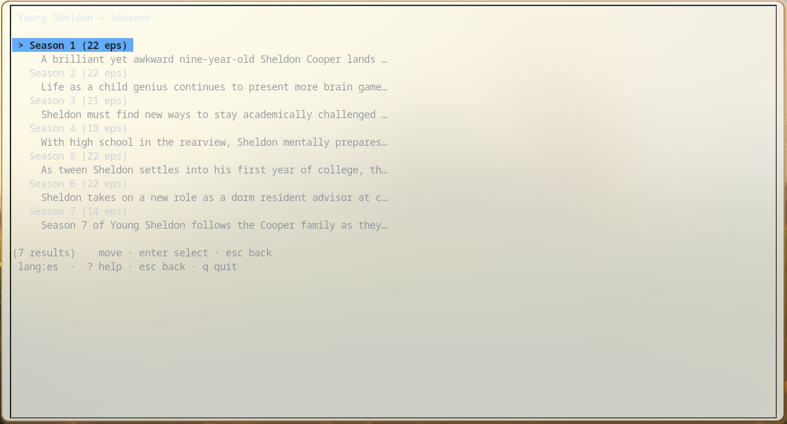
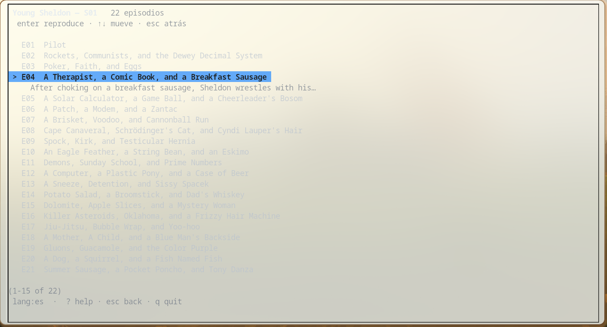
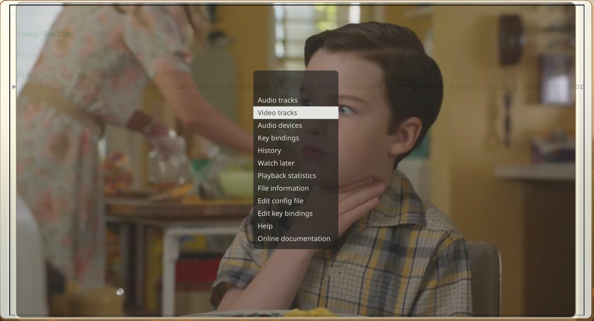

# 🎬 cine-cli

**Watch movies and TV shows from your terminal** — inspired by [ani-cli](https://github.com/pystardust/ani-cli).


```
cine                  # interactive TUI
cine search "inception"
cine play "breaking bad" --season 1 --episode 1
cine doctor
```

Developed by **CamiloDev** · version **1.0.0**

---

## Screenshots

| Home — Continue Watching & Trending | Trending view |
|-------------------------------------|---------------|
|  |  |

| Series detail (synopsis) | Episode list |
|--------------------------|--------------|
|  |  |

| Playing in mpv | mpv menu |
|----------------|----------|
|  |  |

---

## Features

| Feature | Status |
|---------|--------|
| Interactive TUI (Bubble Tea) | ✅ |
| Search movies & series (TMDB) | ✅ |
| Season / episode picker | ✅ |
| Stream resolve → mpv/vlc | ✅ |
| Continue watching (auto-resume) | ✅ |
| Favorites / history / watchlist / bookmarks | ✅ |
| Offline play of downloads | ✅ |
| Subtitles (OpenSubtitles, optional key) | ✅ |
| Interactive source/quality picker | ✅ |
| Spanish / English UI (i18n) | ✅ |
| Plugins (`.so` / scripts) | ✅ |
| `cine doctor` diagnostics | ✅ |
| Docker | ✅ |

## Requirements

- **Go 1.26+** (to build) or a release binary
- **mpv** or **vlc** (player)
- **Google Chrome / Chromium** (required to decrypt stream sources)
- **TMDB API key** (free): https://www.themoviedb.org/settings/api

Optional:
- `yt-dlp` — extra fallback
- OpenSubtitles API key — external subtitles

## Install

```bash
# from source
git clone https://github.com/camilin7483/cine-cli && cd cine-cli
go build -o cine ./cmd/cine
sudo mv cine /usr/local/bin/

# one-time setup
mkdir -p ~/.config/cine-cli
cine config set tmdb_api_key YOUR_KEY
cine config set language es
cine doctor          # verify everything works
```

## Usage

### TUI (default)

```bash
cine
```

Keys:

| Key | Action |
|-----|--------|
| type + enter | Search |
| ↑↓ / j k | Move |
| enter | Select / play |
| t | Trending |
| s | Sidebar (menu) |
| l | Cycle preferred audio language |
| b | Open current title in browser |
| f | Favorite |
| ? | Help |
| esc | Back / stop player |
| q / ctrl+c | Quit |

### CLI

```bash
cine search "dune"               # search
cine watch "dune"                # quick search + play
cine play "dune"                 # play a movie
cine play "breaking bad" -s 1 -e 1
cine trending                    # trending movies & shows
cine popular                     # popular movies
cine history                     # watch history
cine favorites                   # favorites
cine watchlist                   # watchlist
cine offline list                # downloaded media
cine offline play file.mp4       # play a download
cine bookmarks list              # bookmarks
cine bookmarks add movie_id      # add bookmark
cine config get tmdb_api_key     # read config
cine config set player vlc       # change config
cine config path                 # config location
cine providers                   # list stream providers
cine plugin list                 # plugins
cine doctor                      # full diagnostics
cine stats                       # viewing statistics
cine update                      # check for updates
cine completion bash             # shell completion
```

## How streams work

1. Metadata from **TMDB**
2. Source resolve via **vidsrc** data API (WASM decrypt in headless Chrome)
3. CDN JWT from `/generate.php` attached as `?token=`
4. Preflight HTTP check (no window flash on dead links)
5. Play in **mpv** with Referer / Origin / User-Agent headers

When multiple sources resolve, cine-cli shows an **interactive picker** sorted by quality — one source means auto-play.

**Not every title is available.** If the upstream catalog returns 404, cine-cli reports it cleanly — it will not open a browser unless you press `b`.

## Config

`~/.config/cine-cli/config.yaml` — manage it with `cine config set`:

```yaml
language: es
player: mpv
tmdb_api_key: "..."
subtitles_enabled: true
subtitles_language: es
opensubtitles_api_key: ""      # free: https://www.opensubtitles.com/en/consumers
theme_mode: dark
provider: vidsrc
```

```bash
cine config set language es
cine config set player vlc
cine config set subtitles_enabled true
cine config set opensubtitles_api_key KEY
```

## Docker

```bash
docker build -t cine-cli .
docker run --rm -it \
  -e TMDB_API_KEY=... \
  -v /path/to/config:/root/.config/cine-cli \
  cine-cli doctor
```

Note: playback needs host mpv and display; Docker is best for CLI search/doctor.

## Troubleshooting

| Symptom | Fix |
|---------|-----|
| TMDB search fails | `cine config set tmdb_api_key …` |
| Always "no stream" | Install Chromium/Chrome; check `cine doctor` |
| mpv 403/428 | Fixed in 1.0 via token + preflight; try another source |
| Title missing from catalog | Upstream gap — try another title or `b` for browser |
| Episode list cuts header | Fixed in 1.0 (single-line rows + pinned title) |

## Disclaimer

This tool is for educational purposes. It uses third-party embed sources that may change or geo-block. Respect copyright laws in your country.

## License

MIT
